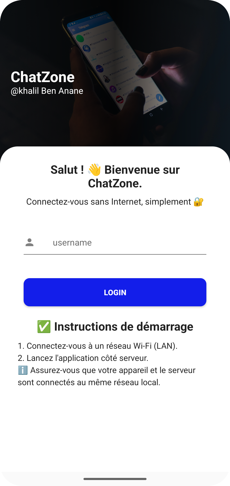

# ChatZone - UDP-Based Android Chat App

ChatZone is a simple local chat application built with Android (Java) and a Java-based UDP server. It allows multiple users to communicate over a local Wi-Fi network using messages and images. The server receives messages from clients and broadcasts them to all other connected clients.

## ✨ Features

- 📡 Real-time messaging using UDP sockets  
- 🖼️ Send and receive image messages (Base64 encoded)  
- 💬 RecyclerView chat UI with message bubbles  
- 🌐 Server-client architecture over local network  
- 📱 Clean and responsive Android UI  

---

## 📷 Screenshots

| Login Interface | Chat Interface |
|--------|----------------|
|  |  |

---

## 🛠️ Tech Stack

### Android Client
- Java  
- UDP Sockets  
- RecyclerView  
- ImageView & Base64 for image transfer  

### Server
- Java (standard)  
- DatagramSocket for UDP communication  

---

## 📁 Project Structure

```
ChatZone/
├── app/
│   ├── java/com/khalil/udpmessage/
│   │   ├── ChatBox.java
│   │   ├── ChatAdapter.java
│   │   ├── ChatMessage.java
│   │   ├── MainActivity.java
│   ├── res/layout/
│   │   ├── chat_box.xml
│   │   ├── chat_message_item.xml
│   │   ├── Activity_main.xml
├── server/
│   └── UDPChatServer.java
├── README.md
```

---

## 🚀 Getting Started

### 🖥️ Server Setup

1. Go to the `UDPChatServer/` folder.  
2. Compile and run the Java server:

```bash
javac Server.java
java Server
```

3. Make sure the server and clients are on the **same local Wi-Fi network**.

### 📱 Android Client Setup

1. Clone this repository:

```bash
git clone https://github.com/your-username/chatzone.git
```

2. Open the project in **Android Studio**.  
3. In `ChatBox.java`, update the line:

```java
serverAddress = InetAddress.getByName("192.168.1.100"); // Replace with your server IP
```

4. Build and run the app on one or more Android devices connected to the same network.

---

## 🧠 How It Works

- When a client sends a message, it is transmitted via UDP to the server.  
- The server receives the packet and forwards it to all other clients.  
- Clients display received messages in the chat UI, either as text or decoded image.  

---

## 🛡️ Limitations & Considerations

- Works only on **local network** (no internet communication).  
- UDP does **not guarantee** message delivery order or reliability.  
- Image size is limited due to UDP packet size (use compression for large images).  

---

## 💡 Future Improvements

- Switch to TCP for reliable messaging  
- Add username/nickname support  
- Push notifications  
- File transfer  
- End-to-end encryption  


---

## 🔧 Server Description
The server is a core component of the ChatZone local chat application. It acts as a central message broker that manages communication between multiple Android clients connected over the same local Wi-Fi network. Built using Java, the server performs the following key roles:

- Listens for incoming client connections on a specified port.
- Manages multiple client connections using multithreading.
- Receives messages (text and image in Base64) from clients.
- Broadcasts messages to all other connected clients in real time.
- Handles connection/disconnection gracefully and ensures continuous operation.
- The server runs on a local computer and must be reachable over the network by all Android devices. It doesn’t require internet access, making it ideal for offline environments such as classrooms, workshops, or emergency communication setups.

---

## 🙌 Acknowledgments

Special thanks to the open-source community for inspiring the development of this project.

---

## 🤝 Contributing

Pull requests are welcome! For major changes, please open an issue first to discuss what you would like to change.

---

## 📬 Contact

Created with ❤️ by **Khalil**  
Feel free to reach out via [Facebook](https://www.facebook.com/khaalyl2) or [email](mailto:benananekhalil@gmail.com)
